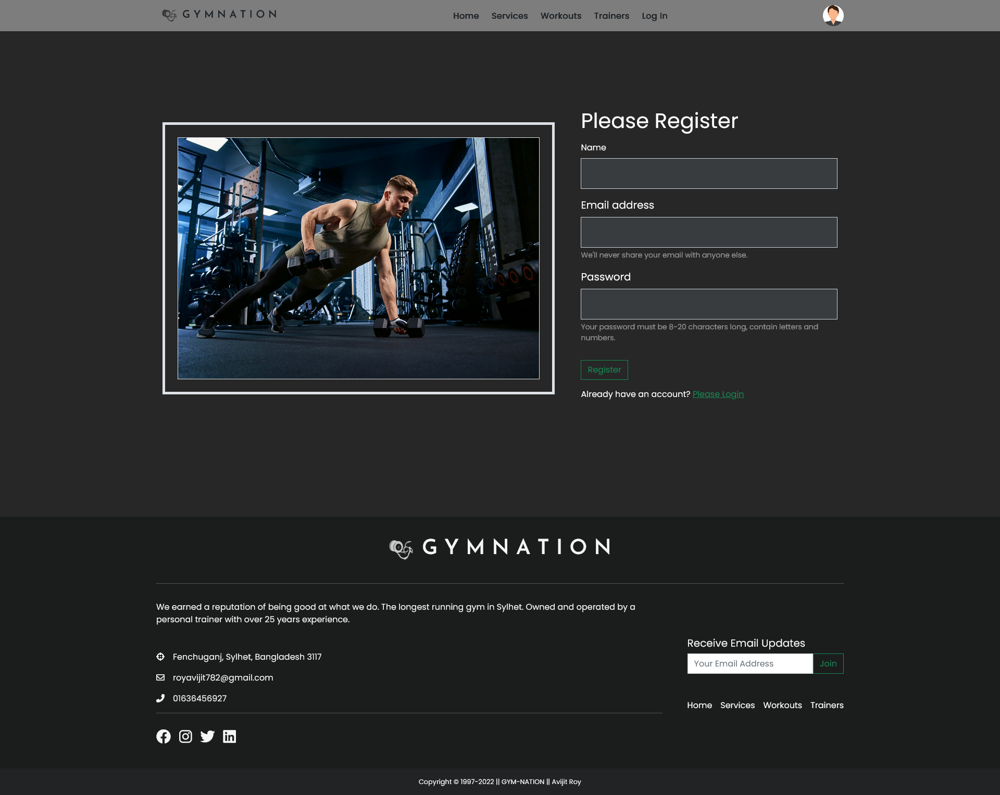

# GYM-NATION -- a gym workout, fitness, healthcare related website

*This was a task for a course of programming hero in 2021*

## Table of contents

- [Overview](#overview)
  - [Links](#links)
  - [The challenge](#the-challenge)
  - [Project features](#project-features)
  - [How to run](#how-to-run)
  - [Screenshot](#screenshot)
- [My process](#my-process)
  - [Built with](#built-with)
- [Author](#author)

## Overview

### Links

- Solution URL: [github link](https://github.com/ankan-782/Gym-nation)
- Live Site URL: [live site link](https://gymnation-73ac6.web.app/)

### The challenge

Users should be able to:

- View the optimal layout for the site depending on their device's screen size
- See hover states for all interactive elements on the page
- use navigation for navigating through sections.
- use mobile menu for navigating sections in tablet and mobile devices.
- Receive an error message when the footer subscribe now `form` is submitted if:
  - The `input` field is empty
  - The email address is not formatted correctly

### Project features

- This is the gym workout fitness related website where trainers doing different classes and users learn about many workouts and see details about classes related information trainer related information.

- This website has basically 5 routes. Home, services, workouts, trainers and login-registration route. In every page there has a header for navigating every pages and there has a footer.

- In home page there has 4 sections which are banner section & some services, about us and contact us.

- Then, in services section all classes available. Then service details will come when user clicks in button. Then all trainers information are present in trainers section. Then all workouts information are present in workouts section.

- From this website any user can see header footer section, all the services, classes, workouts information, trainer information, about us section, contact us section, login registration section, error 404 page.

### How to run

- Clone the repository:

```bash
git clone https://github.com/ankan-782/Gym-nation.git
```

- Navigate to the project directory:

```bash
cd Gym-nation
```

- Install dependencies:

```bash
npm install
```

- run the project:

```bash
npm start
```

### Screenshot

- Full website at larger devices


- Service page at larger devices


- Service details page at larger devices


- Login page at larger devices


- Registration page at larger devices



- Trainers page at larger devices


- workouts page at larger devices


- navbar opened at smaller devices


## My process

### Built with

- React Js
- Semantic JSX markup
- Bootstrap css framework
- Flex-box
- CSS Grid
- Position
- Mobile-first workflow
- Firebase authentication
- Various npm packages

## Author

- Website - [Avijit Roy](https://avijit-roy-portfolio.netlify.app/)
- LinkedIn - [avijit-roy-ankan](https://www.linkedin.com/in/avijit-roy-ankan/)
- Twitter - [@AvijitAnkan](https://twitter.com/AvijitAnkan)
